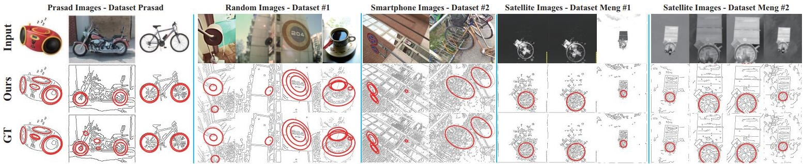
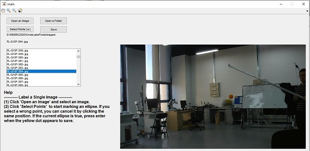
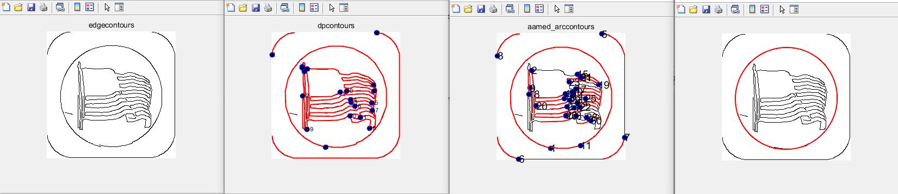
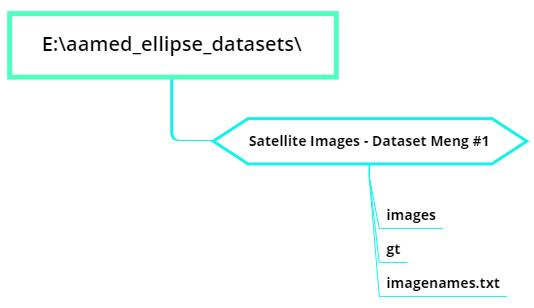

# Arc Adjacency Matrix based Fast Ellipse Detection

We proposed a fast ellipse detection method based on arc adjacency matrix. We have successfully used this method in some applications, such as satellite tracking, UGV guidance and pose estimation.

<div align="center">
  
</div>

:blush:**The binaries for Matlab and Python can be downloaded from the latest release.**


## 1 Compile our Codes

We have successfully applied AAMED to various platforms (Windows, Ubuntu, ARM). The codes used for different platforms may require some minor changes.

### 1.1 Windows

- OpenCV >  3.1.0
- VS 2015

You can add all .h and .cpp files into your project. Don't forget to config your project about OpenCV :). 

main.cpp has given an example to detect ellipses from an image.


**AAMED aamed(drows, dcols)**. drows (dcols) must be larger than the rows (cols) of all used images. Then, we can use **aamed.run_FLED(imgG);** to detect ellipses from multiple images.

**Very important: Please check rows and cols of your input images are smaller than drows and dcols separately, otherwise, there will be some errors at class NODE_FC**


### 1.2 Ubuntu

We use **CMake** to generate *Makefile*, then use make to compile our method. This way is only used for Ubuntu, not suitable for Windows.

    cd AAMED/cmake-build
    cmake ..
    make 
    ./AAMED

### 1.3 Python

For Python, the OpenCV and NumPy packages are required.

**Building**

With the Anaconda distribution of Python (Windows and Linux) and the standard 
Python in Linux, building the library can be done in the following way:
```
cd python
python setup.py build_ext --inplace
```
Once built, the created library (Windows: `.pyd`, Linux: `.so`) can be placed 
anywhere. 

If you are building on Windows without Anaconda, you must install OpenCV 
manually alongside the OpenCV Python package. (Make sure the versions are the 
same!) Then, in the `setup.py` file, the `opencv_root` variable should be set 
to the specified OpenCV installation location. Once this is done, you can 
continue to use the same commands above to build. 

Note: for Windows without Anaconda, the `opencv_world` DLL should be 
together with the `.pyd` as well. Alternatively, if you do not want to copy 
the `opencv_world` DLL around, you can add the OpenCV bin location as a DLL 
directory at the beginning of your script. For example:
```py
import os
os.add_dll_directory("D:/opencv/build/x64/vc14/bin")
```

**Testing**

To quickly test, `test_aamed.py` is provided.
```
python test_aamed.py
```


### 1.4 MATLAB

We have packaged AAMED, it can be used in MATLAB. AAMED needs OpenCV support. Note that if `mexdestoryaamed(obj) `is not called, the memory used in AAMED will remain in MATLAB all the time. Only restart matlab can clear the memory.

**Install**

You need to config OpenCV include path and library path in `setup.m` firstly. Then, you can run `setup.m` to compile **mexAAMED, mexdestoryAAMED, mexdetectImagebyAAMED, mexSetAAMEDParameters**.

**Test**

`test_aamed.m` provides an example to detect ellipses from an image.

    obj = mexAAMED(540, 960); % AAMED only needs to be defined once
    mexSetAAMEDParameters(obj, pi/3, 3.4, 0.77); % Set the parameters.

    % This function can be used multiple times to detect ellipses from images
    detElps = mexdetectImagebyAAMED(obj, img); 

    mexdestoryAAMED(obj); %Free memory (very important).


## 2 Label Tool

we provide a tool to label ellipses (circles) from an image. This tool is based on MATLAB R2016. First, you need to run `setup.m` to compile **mexElliFit**. Then, you can run `main.m` to use this label tool. 

<div align="center">
  
</div>


## 3 AAMED Viewer
we proivide a tool to show critical data (edge contours, DP contours, arc contours, AAM and detected ellipses) in MATLAB. We use this tool to find bugs of AAMED and test functions.

You need to run `setup.m` to compile **mexcvtBasicData, mexcvtRRect, mexcvtVVP, mexcvtAAM**. Then you can use `main.m` to read `DetailAAMED.aamed`.

<div align="center">
  
</div>

## 4 Nine Datasets

We have uploaded 9 datasets used in our paper to [Baidu Cloud (Code: 7br2)](https://pan.baidu.com/s/1vUx7d3mvRxIPGSwi8DLADg)  and [Google Drive](https://drive.google.com/file/d/1Af32acr4g9-4EvbAVMHS7fKVnD-XrDeM/view?usp=sharing).

## 5 Measure Tool

We have provided a tool that can be used to measure our method. Firstly, you need to run `setup.m` in *measuretool/MeasureTools* to build the mex files. Then, `MeasureAllDatasets.m` needs to be configured as described below. Finally, you can run `MeasureAllDatasets.m` to measure the used method.

- **data_root_path**: The root path of all datasets.
- **dataset_name**: The file names of used datasets. *dataset_name* is an array of *cell*, each element in it is a string that represents the dataset file name.
- **gt_label** contains the labels of corresponding datasets. `Read_Ellipse_GT.m` uses these labels to  load ground-truth.
- **methods_name** is the file name that stores the results of used method. 
- **method_label** is the label of corresponding method. `Read_Ellipse_Results.m` uses this label to load detection results.

The sample output of `MeasureAllDatasets.m` is as following.

	Evaluating dataset: Satellite Images - Dataset Meng #2
	Precision: 80.9524%,  Recall: 85%,  F-measure: 82.9268%. 
	Average detected time: 2.6065 ms.


## 6 How to Make your Datasets

The format of ellipse dataset is as follows.
<div align="center">
  
</div>

If you want to make a new dataset, you can put the collected images into the file **images**. Then, the ground-truth files that are generated by labeltool can be put into the file **gt**. Finally, you need to create the file **imagenames.txt** that contains all image names.


If you have any questions, please contact me (lizhaoxi@buaa.edu.cn) or create an issue.
